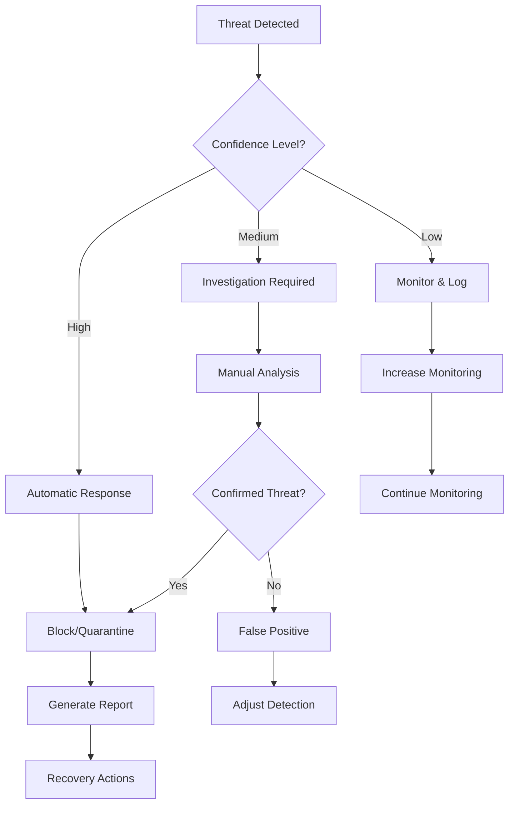

# Threat Protection

Comprehensive guide to Security Sentinel's threat detection, response, and protection capabilities.

## 🛡️ Overview

Security Sentinel's threat protection system provides multi-layered security monitoring with real-time threat detection, automated response capabilities, and intelligent analysis. The system combines signature-based detection, behavioral analysis, and AI-powered threat intelligence to protect against known and unknown security threats.

## 🚨 Threat Detection

### Real-time Monitoring

#### Active Threat Detection
Security Sentinel continuously monitors for various threat types:

```
THREAT DETECTION STATUS
├─ Malware Detection: Active ✅
├─ Network Intrusion: Active ✅  
├─ Process Anomalies: Active ✅
├─ File Integrity: Active ✅
├─ Registry Monitoring: Active ✅
└─ AI Analysis: Ready 🤖

RECENT THREAT ACTIVITY
┌─────────────────────┬──────────────────┬─────────┬──────────┐
│ Timestamp           │ Threat Type      │ Source  │ Status   │
├─────────────────────┼──────────────────┼─────────┼──────────┤
│ 2024-01-15 14:32:15 │ Port Scan        │ External│ Blocked  │
│ 2024-01-15 14:30:45 │ Suspicious Process│ Local  │ Monitored│
│ 2024-01-15 14:28:10 │ File Modification│ Local  │ Alert    │
│ 2024-01-15 14:25:33 │ Network Anomaly  │ External│ Analyzed │
└─────────────────────┴──────────────────┴─────────┴──────────┘
```

#### Threat Categories

**Network-Based Threats**
- **Port Scans**: Automated detection of reconnaissance attempts
- **DDoS Attacks**: Distributed denial of service attack identification  
- **Intrusion Attempts**: Unauthorized access attempts
- **Data Exfiltration**: Suspicious outbound data transfers
- **Command & Control**: C&C server communication detection

**Process-Based Threats**  
- **Malware Execution**: Suspicious executable behavior
- **Process Injection**: Code injection into legitimate processes
- **Privilege Escalation**: Unauthorized privilege elevation attempts
- **System Modification**: Unauthorized system file modifications
- **Resource Abuse**: Excessive resource consumption patterns

**File System Threats**
- **File Integrity Violations**: Unauthorized file modifications
- **Ransomware Indicators**: File encryption patterns
- **Malicious Downloads**: Suspicious file downloads
- **System File Tampering**: Critical system file modifications
- **Hidden File Activity**: Attempts to hide malicious files

### Threat Intelligence

#### AI-Powered Analysis
```
AI THREAT ANALYSIS
├─ Threat Confidence: 87% 🔴 High Risk
├─ Attack Vector: Network-based intrusion attempt
├─ Potential Impact: Data breach, system compromise
├─ Recommended Action: Immediate isolation and investigation
└─ Similar Patterns: 3 related incidents in past 30 days

BEHAVIORAL ANALYSIS
├─ Normal Pattern Deviation: 94%
├─ Anomaly Score: 8.7/10
├─ Risk Classification: Critical
└─ Automatic Response: Triggered
```

#### Threat Classification

**Severity Levels**
- **🔴 Critical**: Immediate action required, high impact threats
- **🟠 High**: Significant risk, prompt attention needed
- **🟡 Medium**: Moderate risk, investigation recommended
- **🔵 Low**: Informational, monitoring suggested
- **⚪ Info**: Normal activity, logged for reference

**Confidence Levels**
- **High (80-100%)**: Strong indicators, automated response triggered
- **Medium (60-79%)**: Moderate confidence, investigation recommended
- **Low (40-59%)**: Weak indicators, monitoring increased
- **Uncertain (<40%)**: Ambiguous signals, human review needed

### Detection Methods

#### Signature-Based Detection
```ini
[signature_detection]
enabled=true
signature_database=threat_signatures.db
update_frequency=daily
custom_signatures=custom_rules.sig
```

**Signature Types**:
- **File Hashes**: Known malware file signatures
- **Network Patterns**: Malicious network traffic signatures  
- **Registry Keys**: Malicious registry modification patterns
- **Process Behavior**: Known malicious process behaviors
- **URL Patterns**: Malicious website and domain patterns

#### Behavioral Analysis
```ini
[behavioral_analysis]
enabled=true
learning_period=7                  # days to learn normal behavior
anomaly_threshold=0.8              # sensitivity (0.0-1.0)
baseline_update_frequency=weekly
```

**Behavioral Indicators**:
- **Unusual Process Execution**: Processes running at unusual times
- **Abnormal Network Activity**: Unexpected network connections
- **File Access Patterns**: Unusual file access or modification patterns
- **System Resource Usage**: Abnormal CPU, memory, or disk usage
- **User Behavior**: Unusual user activity patterns

#### Heuristic Analysis
```ini
[heuristic_analysis]
enabled=true
analysis_depth=comprehensive       # basic, standard, comprehensive
scan_packed_files=true
analyze_code_execution=true
monitor_api_calls=true
```

## 🔒 Threat Response

### Automated Response

#### Response Actions
```ini
[automatic_response]
enabled=true
response_speed=immediate           # immediate, delayed, manual

# Network threats
block_suspicious_ips=true
quarantine_connections=true
notify_firewall=true

# Process threats
terminate_suspicious_processes=false  # Use with caution
quarantine_suspicious_files=true
alert_administrator=true

# File system threats
backup_modified_files=true
restore_critical_files=true
quarantine_malicious_files=true
```

#### Response Levels

**Level 1 - Monitor**
```
MONITOR RESPONSE
├─ Increase monitoring frequency
├─ Log detailed activity
├─ Generate alerts
└─ Continue normal operation
```

**Level 2 - Restrict**
```
RESTRICT RESPONSE  
├─ Limit process capabilities
├─ Block suspicious network connections
├─ Increase security policies
└─ Notify administrators
```

**Level 3 - Isolate**
```
ISOLATE RESPONSE
├─ Quarantine suspected processes
├─ Block all network access
├─ Prevent file system changes
└─ Require manual intervention
```

**Level 4 - Terminate**
```
TERMINATE RESPONSE
├─ Stop malicious processes
├─ Block network communications
├─ Quarantine affected files
└─ System recovery procedures
```

### Manual Response Tools

#### Threat Investigation
```
THREAT INVESTIGATION TOOLS
┌─────────────────────────────────────────────────────────┐
│ [1] Process Tree Analysis                               │
│ [2] Network Connection Investigation                    │
│ [3] File System Forensics                             │
│ [4] Registry Change Analysis                           │
│ [5] Timeline Reconstruction                            │
│ [6] AI-Assisted Analysis                              │
│ [0] Return to Main Menu                               │
└─────────────────────────────────────────────────────────┘
Select investigation tool: _
```

#### Response Actions Menu
```
MANUAL RESPONSE OPTIONS
┌─────────────────────────────────────────────────────────┐
│ Network Actions:                                        │
│ [N1] Block IP Address        [N2] Allow IP Address     │
│ [N3] Reset Connection        [N4] Monitor Traffic      │
│                                                         │
│ Process Actions:                                        │ 
│ [P1] Terminate Process       [P2] Suspend Process      │
│ [P3] Analyze Process         [P4] Quarantine Process   │
│                                                         │
│ File Actions:                                           │
│ [F1] Quarantine File         [F2] Delete File          │
│ [F3] Restore from Backup     [F4] Analyze File         │
└─────────────────────────────────────────────────────────┘
```

### Incident Response

#### Response Workflow


#### Incident Documentation
```
INCIDENT REPORT #2024-0115-001
┌─────────────────────────────────────────────────────────┐
│ Date: 2024-01-15 14:32:15                             │
│ Severity: HIGH                                          │
│ Type: Network Intrusion Attempt                       │
│ Source: 185.220.101.42 (TOR Exit Node)               │
│                                                         │
│ Timeline:                                               │
│ 14:32:15 - Initial detection                          │
│ 14:32:17 - Automatic IP block activated               │
│ 14:32:20 - Firewall rules updated                     │
│ 14:32:25 - Administrator notification sent            │
│                                                         │
│ Actions Taken:                                          │
│ ✅ IP address blocked                                  │ 
│ ✅ Network connections terminated                      │
│ ✅ Security team notified                             │
│ ⏳ Forensic analysis initiated                        │
│                                                         │
│ Status: CONTAINED                                       │
└─────────────────────────────────────────────────────────┘
```

## 🧠 AI-Enhanced Protection

### Intelligent Threat Analysis

#### AI Assistant Integration
```
AI SECURITY ANALYSIS
User: "Analyze this suspicious network activity"

AI Assistant: I've analyzed the network activity and found several concerning patterns:

🔍 ANALYSIS RESULTS:
1. **Reconnaissance Pattern Detected**
   - Source IP 185.220.101.42 attempted connections to ports 22, 80, 443, 3389
   - Pattern consistent with automated scanning tools
   - IP originates from known TOR exit node

2. **Risk Assessment: HIGH**
   - TOR usage indicates anonymization attempt
   - Port scanning suggests reconnaissance phase of attack
   - No successful connections established (good news!)

3. **RECOMMENDED ACTIONS:**
   ✅ Block source IP (already done automatically)
   ✅ Monitor for similar patterns from other IPs
   ✅ Review firewall rules for scanned ports
   ⚠️ Consider blocking TOR traffic if policy allows

Would you like me to analyze any related network activity or help configure additional protections?
```

#### Predictive Analysis
```ini
[ai_prediction]
enabled=true
prediction_horizon=24              # hours
confidence_threshold=0.75
update_model_frequency=weekly
```

**AI Prediction Capabilities**:
- **Attack Timing**: Predict when attacks are most likely
- **Threat Evolution**: Anticipate how threats might evolve
- **Vulnerability Windows**: Identify vulnerable time periods
- **Resource Requirements**: Predict security resource needs

### Machine Learning Features

#### Adaptive Thresholds
```
ADAPTIVE SECURITY THRESHOLDS
├─ Network Anomaly Threshold: 0.82 (↑ from 0.80)
├─ Process Behavior Threshold: 0.75 (↓ from 0.78)  
├─ File Activity Threshold: 0.88 (stable)
└─ System Performance Threshold: 0.70 (↑ from 0.65)

ADJUSTMENT REASONS:
• Network: Increased scanning activity detected
• Process: False positives from legitimate software
• File: Stable baseline established
• Performance: System upgrades improved capacity
```

#### Pattern Learning
- **Normal Behavior Baselines**: Learn what's normal for your environment
- **Attack Pattern Recognition**: Identify recurring attack patterns
- **False Positive Reduction**: Reduce false alarms through learning
- **Threat Attribution**: Link related threats and campaigns

## 🔧 Configuration and Tuning

### Detection Configuration

#### Sensitivity Settings
```ini
[detection_sensitivity]
# Overall sensitivity (1-10, 10 = most sensitive)
global_sensitivity=7

# Category-specific sensitivity
network_sensitivity=8
process_sensitivity=6  
file_sensitivity=7
registry_sensitivity=5

# AI analysis sensitivity
ai_confidence_threshold=0.75
behavioral_anomaly_threshold=0.80
```

#### Custom Rules
```ini
[custom_rules]
# Block specific IP ranges
block_ip_range_1=10.0.0.0/8,high,Blocked private network access
block_ip_range_2=192.168.1.0/24,medium,Internal network monitoring

# Process monitoring rules  
suspicious_process_1=*.tmp.exe,high,Temporary executable files
suspicious_process_2=powershell.exe -EncodedCommand,critical,Encoded PowerShell

# File system rules
critical_file_1=C:\Windows\System32\*.dll,critical,System DLL modification
critical_file_2=C:\Users\*\Documents\*.doc*,medium,Document file changes
```

### Response Configuration

#### Automated Response Rules
```ini
[response_rules]
# Network response
network_block_duration=3600        # seconds (1 hour)
max_blocked_ips=1000
whitelist_local_network=true

# Process response
terminate_malicious_processes=false
quarantine_suspicious_files=true
backup_before_quarantine=true

# Notification settings
email_critical_alerts=true
sms_emergency_alerts=false
webhook_notifications=true
```

#### Custom Response Scripts
```bash
# Custom response script example
# response_scripts/block_ip.bat
@echo off
echo Blocking IP: %1
netsh advfirewall firewall add rule name="SecuritySentinel-Block-%1" dir=in action=block remoteip=%1
echo IP %1 blocked successfully
```

## 📊 Threat Analytics and Reporting

### Threat Dashboard

#### Real-time Metrics
```
THREAT PROTECTION DASHBOARD
┌─────────────────────────────────────────────────────────┐
│ Threats Detected Today: 12                             │
│ ├─ Blocked: 8                                          │
│ ├─ Quarantined: 3                                      │
│ └─ Under Investigation: 1                              │
│                                                         │
│ Threat Types:                                           │
│ ├─ Network Attacks: 7 ████████████████████████████     │
│ ├─ Malware: 3 ████████████                            │  
│ ├─ Suspicious Activity: 2 ████████                     │
│ └─ Policy Violations: 0                                │
│                                                         │
│ System Status: 🟢 PROTECTED                            │
│ Last Update: 14:35:22                                  │
└─────────────────────────────────────────────────────────┘
```

#### Historical Analysis
```
THREAT TRENDS (30 Days)
Week 1: ████████████████████████████████████████ 40 threats
Week 2: ████████████████████████████████ 32 threats
Week 3: ████████████████████████████████████████████ 42 threats  
Week 4: ██████████████████████████████ 28 threats

TOP THREAT SOURCES
┌─────────────────────┬─────────┬─────────┬──────────┐
│ Source Type         │ Count   │ Blocked │ Success  │
├─────────────────────┼─────────┼─────────┼──────────┤
│ Automated Scans     │ 85      │ 85      │ 0%       │
│ Malware Downloads   │ 12      │ 10      │ 17%      │
│ Suspicious Processes│ 8       │ 6       │ 25%      │
│ Data Exfiltration   │ 3       │ 3       │ 0%       │
└─────────────────────┴─────────┴─────────┴──────────┘
```

### Reporting and Analytics

#### Automated Reports
```ini
[reporting]
generate_daily_reports=true
generate_weekly_summaries=true
generate_monthly_analysis=true

# Report formats
pdf_reports=true
csv_exports=true
json_api_data=true

# Report recipients
email_reports=security@company.com
webhook_reports=https://siem.company.com/api/reports
```

#### Executive Summary Reports
```
EXECUTIVE SECURITY SUMMARY - January 2024

SECURITY POSTURE: STRONG 🟢
├─ Overall Risk Level: LOW
├─ Threats Blocked: 147
├─ System Availability: 99.9%
└─ Security Score: 94/100

KEY METRICS:
├─ Mean Time to Detection: 0.3 seconds
├─ Mean Time to Response: 1.2 seconds  
├─ False Positive Rate: 2.1%
└─ Coverage Effectiveness: 98.7%

THREAT LANDSCAPE:
├─ Primary Threats: Network scanning, malware
├─ Attack Vectors: Email, web downloads, network
├─ Geographic Origins: 45% Europe, 30% Asia, 25% Americas
└─ Trend Analysis: 15% decrease from previous month

RECOMMENDATIONS:
✅ Current security posture is strong
⚠️ Consider additional email security measures  
📊 Continue monitoring emerging threat patterns
```

## 🔍 Advanced Threat Hunting

### Proactive Hunting

#### Threat Hunting Queries
```sql
-- Hunt for suspicious PowerShell activity
SELECT timestamp, process_name, command_line, user_account
FROM process_events 
WHERE process_name LIKE '%powershell%' 
AND command_line LIKE '%EncodedCommand%'
ORDER BY timestamp DESC;

-- Look for unusual network connections
SELECT timestamp, local_port, remote_ip, remote_port, process_name
FROM network_connections
WHERE remote_ip NOT IN (SELECT ip FROM whitelist_ips)
AND connection_state = 'ESTABLISHED'
ORDER BY timestamp DESC;
```

#### Hunting Methodologies
- **Hypothesis-Based Hunting**: Hunt based on threat intelligence
- **Baseline Deviation Hunting**: Look for deviations from normal
- **IoC-Based Hunting**: Hunt for specific indicators of compromise
- **Behavioral Hunting**: Hunt for suspicious behavior patterns

### Threat Intelligence Integration

#### External Threat Feeds
```ini
[threat_intelligence]
enable_external_feeds=true
update_frequency=hourly

# Commercial threat feeds
virustotal_api_key=your_vt_api_key
malwarebytes_feed=true
crowdstrike_feed=false

# Open source feeds
misp_integration=true
otx_alien_vault=true
abuse_ch_feeds=true
```

#### Custom Threat Intelligence
```ini
[custom_intelligence]
internal_ioc_database=company_iocs.db
partner_threat_sharing=true
industry_threat_sharing=false
threat_attribution=true
```

## 🛠️ Forensics and Investigation

### Digital Forensics Tools

#### Evidence Collection
```
FORENSIC EVIDENCE COLLECTION
┌─────────────────────────────────────────────────────────┐
│ [1] Memory Dump                                         │
│ [2] Process Dump                                        │ 
│ [3] Network Capture                                     │
│ [4] File System Snapshot                               │
│ [5] Registry Export                                     │
│ [6] Event Log Export                                   │
│ [7] Complete System Image                              │
│ [0] Return to Investigation Menu                       │
└─────────────────────────────────────────────────────────┘
```

#### Timeline Analysis
```
SECURITY INCIDENT TIMELINE
14:30:00 - Normal system operation
14:31:45 - Suspicious PowerShell execution detected
14:31:47 - Encoded command executed: [Base64 decoded content]
14:31:50 - Outbound network connection to 185.220.101.42:443
14:31:52 - File download initiated: malware.exe
14:31:55 - Antivirus signature detection triggered
14:31:57 - File quarantined by Security Sentinel
14:32:00 - Network connection blocked
14:32:05 - Administrator alert sent
14:32:10 - Investigation initiated
```

### Root Cause Analysis

#### Incident Analysis Framework
1. **Detection**: How was the threat initially detected?
2. **Entry Vector**: How did the threat enter the system?
3. **Progression**: How did the threat attempt to progress?
4. **Impact**: What was the potential or actual impact?
5. **Response**: How effective was the automated response?
6. **Lessons Learned**: What can be improved?

This comprehensive threat protection guide demonstrates Security Sentinel's multi-layered approach to security monitoring and threat response. The combination of real-time monitoring, AI-enhanced analysis, and automated response capabilities provides robust protection against both known and unknown security threats.